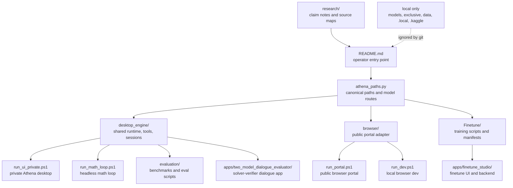

# AEN / AthenaV5

AthenaV5 is the local-first AEN workspace for model runtime, the browser portal, the private desktop launcher, training utilities, evaluation harnesses, and research notes. The GitHub surface is intentionally clean: source, tests, launchers, config templates, and evidence-indexed documentation belong here; model weights, secrets, local user data, runtime state, and bulky run exports stay local.

## Repository Flow



## Clean Repo Contract

- Commit source code, tests, launchers, templates, small manifests, and research notes that explain why a change exists.
- Keep model weights, private desktop state, auth files, user data, generated notebooks, pycache, Kaggle output workspaces, and large run artifacts out of git.
- Public-facing claims should name the artifact, transcript, score file, or controller state that supports them.
- Mid-run observations are allowed in research notes, but label them as live or provisional until a packaged export exists.

## Active Surfaces

- `athena_paths.py` is the canonical path resolver and model-route helper.
- `desktop_engine/` is the shared engine for runtime calls, session flow, tools, and math-loop support.
- `browser/` is the browser portal adapter and public-facing config surface.
- `run_ui_private.ps1` launches the private Athena desktop against the local exclusive model tree.
- `run_portal.ps1` launches the production browser portal and expects a reachable vLLM sidecar.
- `Finetune/` contains training scripts, recipes, retained manifests, and dataset builders.
- `apps/finetune_studio/` is the local finetune studio UI.
- `apps/two_model_dialogue_evaluator/` is the standalone solver-verifier dialogue app.
- `evaluation/` and `testdata/` contain committed eval scripts and compact benchmark fixtures.
- `research/` carries architecture notes, source maps, and claim-boundary documentation.

## Launchers

Private Athena desktop:

```powershell
Set-Location D:\AthenaPlayground\AthenaV5
.\run_ui.ps1
```

Direct private launcher:

```powershell
Set-Location D:\AthenaPlayground\AthenaV5
.\run_ui_private.ps1
```

Private Athena desktop with tools:

```powershell
.\run_ui_private.ps1 -Tools
```

Public browser dev:

```powershell
.\run_dev.ps1
```

Public browser prod:

```powershell
.\run_portal.ps1
```

Headless math loop:

```powershell
.\run_math_loop.ps1 -Problem "What is 7 + 8?"
```

Evaluation scripts:

```powershell
.\evaluation\scripts\evaluate_math_loop.ps1 -Limit 25
```

Standalone two-model evaluator:

```powershell
Set-Location D:\AthenaPlayground\AthenaV5\apps\two_model_dialogue_evaluator
.\run.ps1
```

## Offline Operation

AthenaV5 can be operated without the public browser portal. This is the recommended offline/local path when the model files and private assets already exist on the machine.

Private desktop, no external browser:

```powershell
Set-Location D:\AthenaPlayground\AthenaV5
$env:ATHENA_VLLM_ENABLE_THINKING = "0"
Remove-Item Env:ATHENA_VLLM_REASONING_PARSER -ErrorAction SilentlyContinue
.\run_ui_private.ps1
```

Private desktop with tools:

```powershell
.\run_ui_private.ps1 -Tools
```

Headless local math loop:

```powershell
.\run_math_loop.ps1 -Problem "What is 7 + 8?"
```

Local route/model verification:

```powershell
python .\verify.py
```

Offline operation still needs local model assets and a local Linux/WSL vLLM runtime, or an already-running vLLM-compatible endpoint set through `ATHENA_PRIVATE_VLLM_BASE_URL` / `ATHENA_VLLM_BASE_URL`. It does not require Cloudflare, browser auth, or the public portal.

## Thinking-Off Contract

AthenaV5 is configured to suppress Qwen thinking traces by default. Keep all of these settings aligned when running or modifying the app:

- `browser/config/gui_config.json`: `"enable_thinking": false` and `"hide_thoughts": true`
- `run_ui_private.ps1`: creates the same private GUI defaults under `exclusive/config/gui_config.json`
- `run_vllm.ps1`: writes `ATHENA_VLLM_ENABLE_THINKING=0` into the runtime env and warms up with `chat_template_kwargs = @{ enable_thinking = $false }`
- `desktop_engine/vllm_openai_runtime.py`: sends `chat_template_kwargs: {"enable_thinking": false}` unless `ATHENA_VLLM_ENABLE_THINKING` is explicitly enabled

For a clean shell before launch:

```powershell
$env:ATHENA_VLLM_ENABLE_THINKING = "0"
Remove-Item Env:ATHENA_VLLM_REASONING_PARSER -ErrorAction SilentlyContinue
```

Do not set `ATHENA_VLLM_ENABLE_THINKING=1`, do not pass a reasoning parser, and keep `hide_thoughts` true in GUI config if the goal is complete no-thinking/no-CoT operation.

## Runtime Notes

- Windows portal launches require a Linux/WSL vLLM endpoint or `ATHENA_VLLM_BASE_URL` pointing to an external vLLM server.
- Private desktop launch expects the local `exclusive/` tree and private model assets to exist on the machine. Those assets are intentionally ignored.
- Default public model routes resolve through `athena_paths.py`; local overrides belong in `.local/config/athena_model_routes.json`.
- Browser auth examples live at `browser/config/portal_auth.env.example`; real auth files stay ignored.
- No-thinking operation is controlled by the `Thinking-Off Contract` above.

## Result And Claim Policy

- Do not describe a result as validated without a path to the supporting score, transcript, manifest, or run note.
- Every transcript analysis should include an id, artifact path, loop count, answer, closeout mode, peer-validation state, and local verdict.
- Keep public language descriptive: architecture, evidence, limitation, and next test.
- Research and history notes belong under `research/`, not loose at the repo root.

## Source Of Truth

- Paths/defaults: `athena_paths.py`
- Engine runtime: `desktop_engine/runtime.py`, `desktop_engine/vllm_openai_runtime.py`
- Engine session/events: `desktop_engine/session.py`, `desktop_engine/events.py`
- Tool execution: `desktop_engine/tools.py`
- Agentic math loop: `desktop_engine/agentic/`
- Browser adapter: `browser/portal_server.py`
- Private desktop seed: `archive/shared_archives/private_desktop_seed_2026-03/`
- Research index: `research/README.md`, `research/SOURCE_MAP.md`

## Local-Only Material

These directories are expected to exist locally on working machines but should not be pushed unless a future cleanup pass creates a scrubbed, compact, intentional artifact:

- `models/`
- `exclusive/`
- `data/`
- `.local/`
- `.kaggle/`
- `colab_outputs/`
- raw notebook and Kaggle output workspaces
- generated PDFs, images, pycache, logs, and build products
