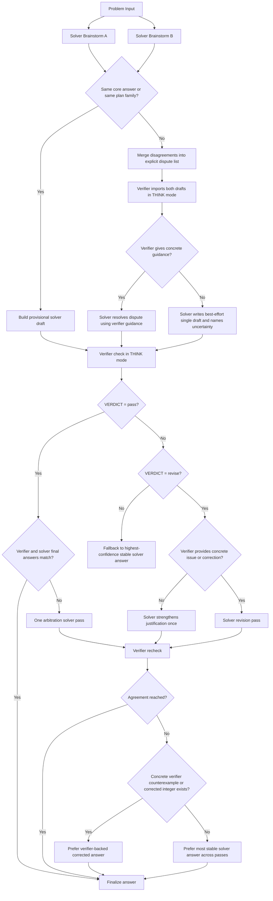

# AIMO3 Qwen9B + Phi15B Flowchart

Date: 2026-03-20

Historical note:

- this file records the bounded structured solver/verifier algorithm from the 2026-03-20 phase
- it remains useful as an ablation and fallback design
- it is not the current visible AEN5 notebook transcript contract after the 2026-03-22 peer-dialogue refactor
- for the current notebook-surface direction, see `research/AIMO3_PEER_DIALOGUE_NOTEBOOK_2026_03_22.md`

## Goal

Define a bounded solver/verifier algorithm for:

- Solver: `Qwen3.5-9B`
- Verifier: `Phi-4-reasoning-vision-15B`

Serving note:

- the verifier checkpoint is vision-capable in principle
- the canonical runtime serves it in `text-only` mode
- no image inputs, vision encoder passes, or multimodal profiling are part of this algorithm

The purpose of this note is to make the control flow explicit before wiring the full runtime.

## Fixed Generation Policy

These are the target algorithm settings, not the lightweight load-probe smoke settings.

- Solver temperature: `0.23` to `0.30`
- Verifier temperature: `0.23` to `0.30`
- Solver max new tokens: `4096`
- Verifier max new tokens: `4096`
- Verifier thinking: `ON`
- Max full verification loops: `2`

Recommended starting point:

- Solver brainstorm A: `temperature=0.23`
- Solver brainstorm B: `temperature=0.30`
- Verifier check: `temperature=0.23`
- Solver revision: `temperature=0.27`
- Verifier recheck: `temperature=0.27`

## Role Design

### Solver

The solver is responsible for:

- producing candidate mathematical plans
- committing to a current best integer answer
- asking the verifier one targeted question if needed
- revising only when the verifier exposes a concrete flaw

The solver should not roleplay the verifier.

### Verifier

The verifier is responsible for:

- using thinking mode
- operating only on the provided text
- checking arithmetic, hidden assumptions, missing cases, invalid reductions, and unsupported jumps
- deciding whether the current solver answer is justified
- either:
  - passing the answer
  - requesting revision
  - marking the draft insufficient

The verifier should not become a free-form second solver unless it is giving a concrete counterexample or correction.

## Output Contracts

### Solver Output

```text
FINAL_ANSWER:
CONFIDENCE:
QUESTION_FOR_VERIFIER:
SOLUTION:
```

### Verifier Output

Phi may emit a leading `<think>...</think>` block. After stripping that, require:

```text
VERDICT:
FINAL_ANSWER_CHECK:
ANSWER_TO_SOLVER:
SUGGESTIONS_FOR_SOLVER:
ISSUES:
```

## Robust Flowchart



## Step-by-Step Algorithm

1. Generate `Brainstorm A` from the solver at `temperature=0.23`.
2. Generate `Brainstorm B` from the solver at `temperature=0.30`.
3. Compare:
   - if both converge on the same integer or the same plan family, build one provisional solver draft
   - if they diverge materially, pass both to the verifier and force the verifier to identify the exact dispute
4. Run verifier in thinking mode on the provisional draft or merged dispute set.
5. If verifier passes and both models effectively agree on the same integer, finalize.
6. If verifier says revise and provides a concrete issue, run one solver revision pass.
7. Re-run verifier once.
8. If agreement is still missing, use the final tie-break rule below.

## Final Tie-Break Rule

Use this exact priority:

1. Prefer an integer answer that is stable across both solver brainstorms and passes verifier.
2. If verifier provides a concrete counterexample, arithmetic correction, or corrected integer, prefer the verifier-backed correction.
3. If verifier only gives vague criticism without a concrete contradiction, prefer the solver's most stable integer across attempts.
4. Do not continue looping beyond two verifier cycles.

## Why This Structure

This design tries to get the benefit of verifier guidance without pretending the verifier can conjure knowledge from nowhere.

The main intended gains are:

- catching arithmetic slips
- exposing missing cases
- forcing the solver to answer a concrete objection
- preventing unstable first-pass answers from going straight to final

The main limitation remains:

- if the solver genuinely does not know the mathematics, the verifier can only help if it identifies a concrete flaw or correction

## Immediate Wiring Plan

When the Phi model is ready, the runtime should implement this exact sequence:

1. `solver_brainstorm_a`
2. `solver_brainstorm_b`
3. `verifier_import_or_check`
4. `solver_revision`
5. `verifier_recheck`
6. `finalize`

No additional open-ended loops should be added until this bounded version is tested.
