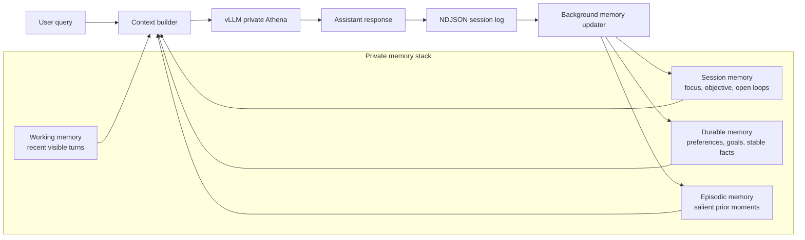
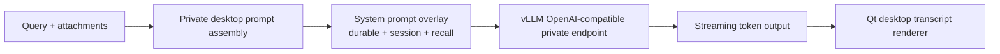

# Private Persistent Memory Architecture

## Scope

This note records the March 19, 2026 private-memory rollout for Athena V5 Desktop.

The goal is local-only continuity for the private desktop path without replaying the full transcript on every turn.

Private memory is now layered, bounded, inspectable, and user-resettable.

## High-Level Flow

## Inference Stack

## Storage Layout

Canonical local paths live under `exclusive/`:

- transcript logs
  - `exclusive/logs/desktop/*.ndjson`
- private memory root
  - `exclusive/memory/athena_private_default/`
- durable profile
  - `exclusive/memory/athena_private_default/profile.json`
- active session memory
  - `exclusive/memory/athena_private_default/session.json`
- memory settings
  - `exclusive/memory/athena_private_default/settings.json`
- episodic recall index
  - `exclusive/memory/athena_private_default/episodes.sqlite`

The NDJSON transcript remains the ground-truth audit trail. Structured memory is derived from it and can be reset independently.

## Memory Layers

### Working memory

- bounded to the last 8 user/assistant turn pairs
- kept in active prompt context
- restored on app restart from the latest logged `turn_done`

### Session memory

- current focus
- current objective
- open loops
- next best action
- active files
- pending follow-ups

This is compact state for the current line of work, not a replay of the whole transcript.

### Durable memory

- preferences
- goals
- identity-like stable facts
- recurring projects
- domains
- tool preferences
- stable constraints

Only stable high-value facts should persist here.

### Episodic memory

- stored in SQLite + FTS5
- used for lexical recall of salient prior moments
- designed for selective recall, not full replay

## Prompt Assembly Order

Per turn, the private desktop now builds context in this order:

1. base private system prompt
2. durable memory
3. session memory
4. recalled episodic memory
5. recent working-memory turns
6. current user query

This preserves continuity while staying bounded.

## Update Lifecycle

After `turn_done`:

1. the desktop logger writes the ground-truth event
2. the memory manager schedules a background refresh
3. session memory is rewritten from recent turns
4. durable memory is updated from stable user signals
5. a salient episode may be inserted into SQLite

The current v1 updater is deterministic and local. It does not yet use a second model-authored summarizer pass.

## User Controls

The private desktop now exposes explicit memory controls:

- `Memory Live / Memory Paused`
- `Export Memory`
- `Forget Session`
- `Forget Durable`
- `Forget All`
- `Clear Logs+Memory`

Reset semantics:

- `Clear Chat`
  - clears the visible conversation and session continuity
  - preserves durable memory and episodic memory
- `Forget Session`
  - clears session memory and recent resume continuity
  - preserves durable memory, episodic memory, and logs
- `Forget Durable`
  - clears durable profile memory only
- `Forget All`
  - clears structured memory artifacts and the episodic index
  - preserves raw NDJSON logs
- `Clear Logs+Memory`
  - clears structured memory artifacts
  - removes private desktop NDJSON logs
  - resets local private history to a clean slate

## Fixed Regression

During the first rollout, a turn-finalization bug mixed dict snapshots with `RuntimeMessage` objects inside the private session layer. That caused the UI error:

- `'dict' object has no attribute 'role'`

The fix was to keep typed `RuntimeMessage` history inside the session engine until the final UI emission step and only serialize to dicts at the edge.

## Current Limits

- no semantic embedding recall yet
- no model-authored consolidation pass yet
- one default local persona namespace
- lexical episodic recall only in v1

These limits are acceptable for the first stable private-memory rollout because they preserve determinism and keep local behavior inspectable.

## Verification Surface

The rollout is backed by local contract coverage for:

- resume from logged private turns
- bounded working-memory trimming
- prompt overlay composition
- background memory refresh
- logs + memory wipe behavior
- private turn completion after restored history
